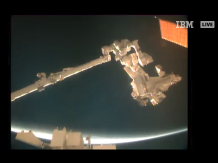
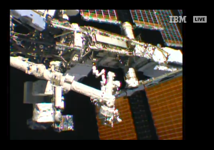

## MMM-ISS-Live

* Displays live video from the International Space Station

* Audio from the ISS (when available)

Live video from the International Space Station includes internal views when the crew is on-duty 
and Earth views at other times. The video is accompanied by audio of conversations between the
crew and Mission Control. This video is only available when the space station is in contact with the ground.

During "loss of signal" periods, viewers will see a blue screen. Since the station orbits the Earth once
every 90 minutes, it experiences a sunrise or a sunset about every 45 minutes. When the station is in 
darkness, external camera video may appear black, but can sometimes provide spectacular views of lightning
or city lights below.

## Examples
The module is a live stream. These are still shots, obviously.

  

## Installation

* `git clone https://github.com/mykle1/MMM-ISS-Live` into the `~/MagicMirror/modules` directory.

## Config.js entry and options

    {
    disabled: f,
    module: 'MMM-ISS-Live',
    position: 'bottom left',
    config: {
        useHeader: false,                // true if you want a header
        header: "",                      // Change in config file. useHeader must be true
        animationSpeed: 1000,            // fade speed
    }
},

